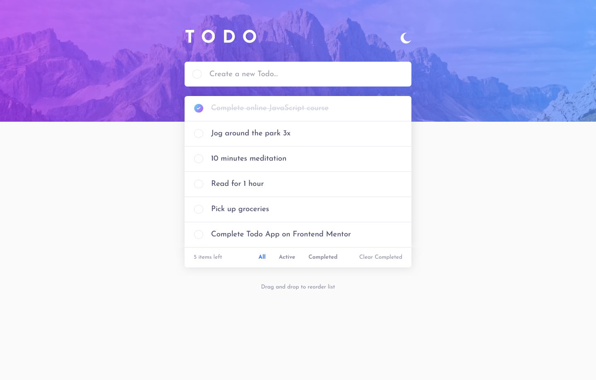

# Frontend Mentor - Todo app solution

This is a solution to the [Todo app challenge on Frontend Mentor](https://www.frontendmentor.io/challenges/todo-app-Su1_KokOW). Frontend Mentor challenges help you improve your coding skills by building realistic projects. 

## Table of contents

- [Overview](#overview)
  - [Screenshot](#screenshot)
- [My process](#my-process)
  - [Built with](#built-with)
- [Author](#author)

## Overview

### Screenshot

### Links

- Live Site URL: [todo-app-main](https://caleberl.github.io/todo-app-main/) 

## My process

### Built with

- Semantic HTML5 markup
- CSS custom properties
- React
- Flexbox

## Author

- Frontend Mentor - [@CalebeRL](https://www.frontendmentor.io/profile/CalebeRL)

